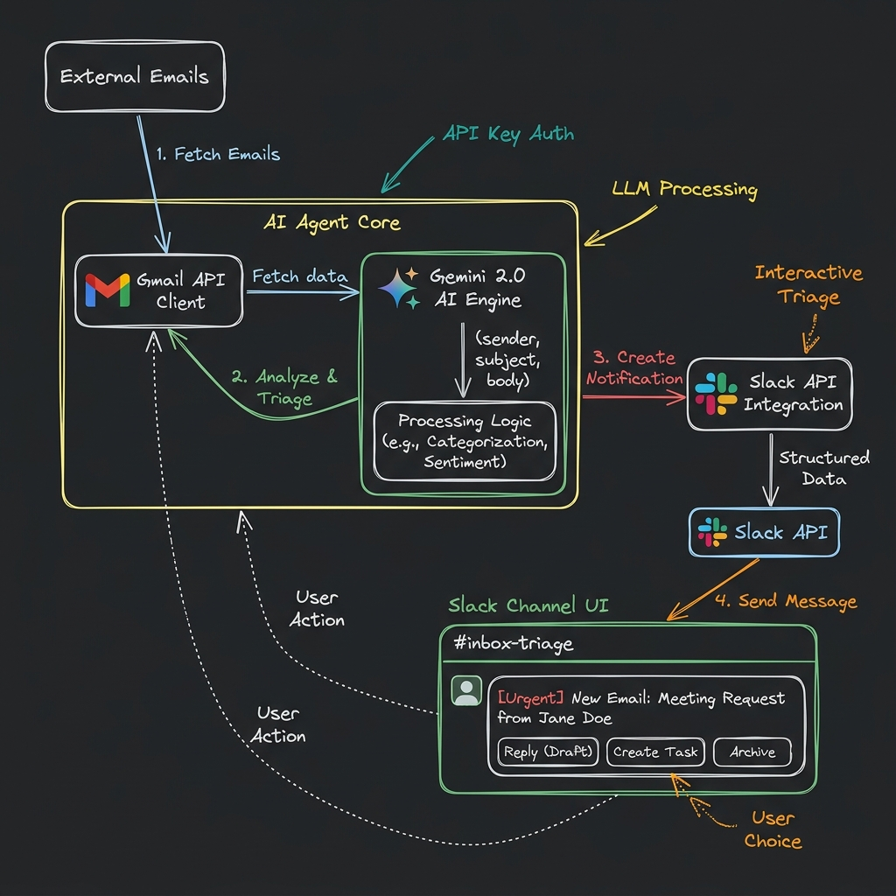
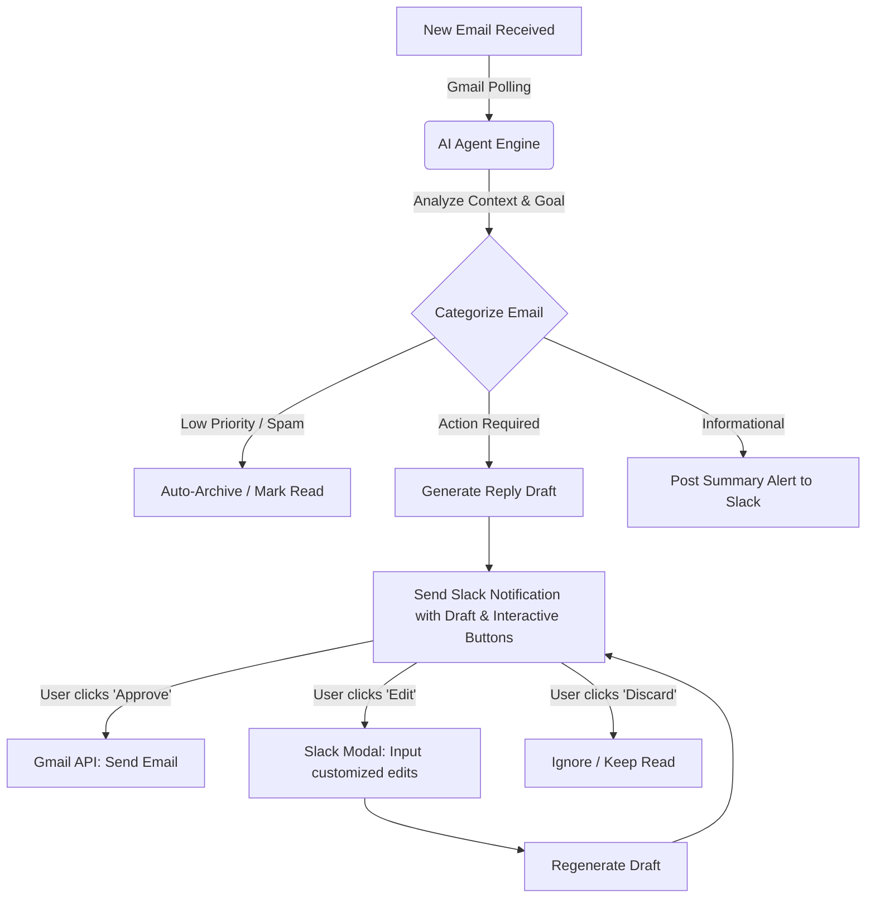
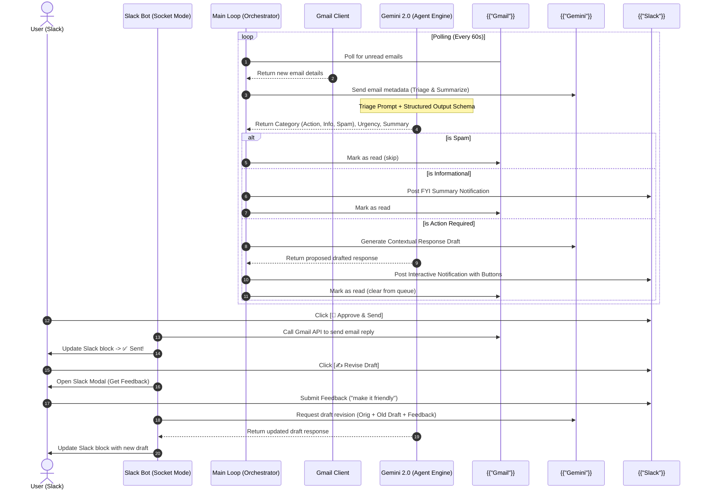

# ⚡ Slack-Gmail Agentic AI Copilot

<div align="center">

  <!-- Brand Logos -->
  <p align="center">
    
    &nbsp;&nbsp;&nbsp;&nbsp;&nbsp;&nbsp;&nbsp;&nbsp;
    
    &nbsp;&nbsp;&nbsp;&nbsp;&nbsp;&nbsp;&nbsp;&nbsp;
    
    &nbsp;&nbsp;&nbsp;&nbsp;&nbsp;&nbsp;&nbsp;&nbsp;
    
  </p>

  <!-- Solid Brand Badges -->
  <p align="center">
    <a href="https://python.org"></a>
    &nbsp;
    <a href="https://ai.google.dev"></a>
    &nbsp;
    <a href="https://api.slack.com"></a>
    &nbsp;
    <a href="https://developers.google.com/gmail/api"></a>
  </p>

  <p align="center">
    <b>An autonomous agentic AI copilot that triages your Gmail inbox, generates contextual drafts using Gemini 2.0, and puts control directly in your Slack workspace.</b>
  </p>
</div>

---

## 🎨 System Architecture Design (Excalidraw Style)

Here is a visual layout of the components interacting across Gmail, Google Gemini, and Slack:

<div align="center">
  
</div>

---

## 📐 Decision Flowchart & Agentic Logic

The orchestrator polling loop queries Gmail, passes email data to the Gemini engine with **Structured Outputs** (enforced by Pydantic), triages the intent, and maps appropriate action vectors.



---

## 🔄 Interaction Sequence (Socket Mode Routing)

This diagram shows the complete sequence of message routing, API calls, and the **Human-in-the-Loop (HITL)** revision loop:



---

## 🌟 Key Features

*   🧠 **Structured Triage**: Utilizes Pydantic schemas and Gemini Structured Outputs to classify email intent with near-perfect consistency.
*   💬 **Human-in-the-Loop Revision**: Don't like the draft? Click `Revise Draft` to open a Slack Modal, type what you want to change, and the agent regenerates the draft.
*   ⚡ **Zero-Tunneling Socket Mode**: Running locally over WebSockets. No `ngrok` or port-forwarding required.
*   ⏱️ **Built-in Rate-Limiting**: Polling runs on a controlled delay system to respect free-tier Gemini API limitations.

---

## 📁 Directory Structure

```
gmail-slack-agent/
├── .env.example              # Template config with placeholders
├── .gitignore                # File to exclude sensitive data from GitHub
├── requirements.txt          # Third-party library list
├── config.py                 # Configuration loader with force-override support
├── main.py                   # Main loop orchestrator with rate-limit sleep controls
├── README.md                 # Project guide (this file)
├── assets/
│   └── architecture_diagram.png # Hand-drawn Excalidraw design diagram
├── integrations/
│   ├── gmail_client.py       # Handles local OAuth flow, reads unread mail, writes replies
│   └── slack_client.py       # Handles Socket Mode, interactive button clicks, and revision modals
├── agent/
│   ├── templates.py          # Structured triage & draft prompt templates
│   └── engine.py             # Interfaces with Gemini using structured outputs
└── tests/
    ├── __init__.py
    ├── test_agent.py         # Mock tests for AgentEngine offline execution
    └── test_gmail.py         # Mock tests for Gmail parser and decoder logic
```

---

## 🔑 Setup & Configuration

### 1. Slack App Configuration (Socket Mode)
1.  Go to the [Slack App Console](https://api.slack.com/apps) and click **Create New App** -> **From Scratch**. Name your app (e.g., `Gmail AI Agent`) and choose your workspace.
2.  **Enable Socket Mode**:
    *   Navigate to **Socket Mode** in the left sidebar and toggle it **On**.
    *   It will ask you to generate an **App-Level Token**. Set the name (e.g., `AppToken`) and add the `connections:write` scope.
    *   Copy the token (starts with `xapp-...`). This is your `SLACK_APP_TOKEN`.
3.  **Add Scopes & Permissions**:
    *   Navigate to **OAuth & Permissions** in the sidebar.
    *   Scroll down to **Scopes** -> **Bot Token Scopes** and add:
        *   `chat:write` (Allows the bot to post messages)
        *   `chat:write.public` (Allows posting to public channels without joining)
    *   Scroll up and click **Install to Workspace**. Authorize the app.
    *   Copy the **Bot User OAuth Token** (starts with `xoxb-...`). This is your `SLACK_BOT_TOKEN`.
4.  **Get Signing Secret**:
    *   Go to **Basic Information** and find the **Signing Secret** under "App Credentials". Copy this as `SLACK_SIGNING_SECRET`.
5.  **Enable Interactivity**:
    *   Go to **Interactivity & Shortcuts** in the sidebar and toggle it **On**. (You don't need a Request URL since Socket Mode handles events). Click **Save Changes**.

### 2. Google Cloud / Gmail API Configuration
1.  Go to the [Google Cloud Console](https://console.cloud.google.com/).
2.  Create a new project.
3.  Search for **Gmail API** in the library search bar and click **Enable**.
4.  **Configure OAuth Consent Screen**:
    *   Go to **OAuth consent screen** -> Choose **External** -> Click **Create**.
    *   Fill in basic info (App name, support email, developer email).
    *   In **Scopes**, click **Add or Remove Scopes** and manually enter:
        *   `https://www.googleapis.com/auth/gmail.readonly`
        *   `https://www.googleapis.com/auth/gmail.compose`
        *   `https://www.googleapis.com/auth/gmail.modify`
    *   In **Test Users**, click **Add Users** and add the Gmail address you want to monitor.
5.  **Create Credentials**:
    *   Go to the **Credentials** tab -> Click **+ Create Credentials** -> Select **OAuth client ID**.
    *   Set Application Type to **Desktop app**. Name it `Gmail Slack Agent`.
    *   Click **Create**, then click **Download JSON** on the OAuth client screen.
    *   Rename this downloaded file to `credentials.json` and save it directly in the project root.

### 3. Gemini API Key
*   Obtain a Gemini API key from [Google AI Studio](https://aistudio.google.com/). Select **Create key in new project** to avoid project-level quota policies.

---

## 🚀 Installation & Running

1.  **Clone or Open the Project**:
    ```bash
    cd gmail-slack-agent
    ```

2.  **Install dependencies**:
    ```bash
    pip install -r requirements.txt
    ```

3.  **Setup Environment Variables**:
    *   Copy `.env.example` to a new file named `.env`:
    *   Fill in all configuration keys:
    ```env
    GEMINI_API_KEY=AIzaSy...
    SLACK_BOT_TOKEN=xoxb-...
    SLACK_APP_TOKEN=xapp-...
    SLACK_SIGNING_SECRET=...
    SLACK_CHANNEL_ID=C...       # Target channel ID
    POLL_INTERVAL_SECONDS=60
    ```

4.  **Run the Application**:
    ```bash
    python main.py
    ```

5.  **First-time Google Auth**:
    *   On the first run, the terminal will open a browser window requesting Google Account permissions.
    *   Sign in with your registered Gmail test user account.
    *   After approval, a file named `token.json` will be saved locally so you won't need to authenticate again.

---

## 🔄 How to Test
1.  Send an unread test email to yourself from another account.
2.  Watch the Python terminal detect the email.
3.  Go to your Slack channel and view the AI's triage card.
4.  Interact with the buttons to approve, revise, or discard!
